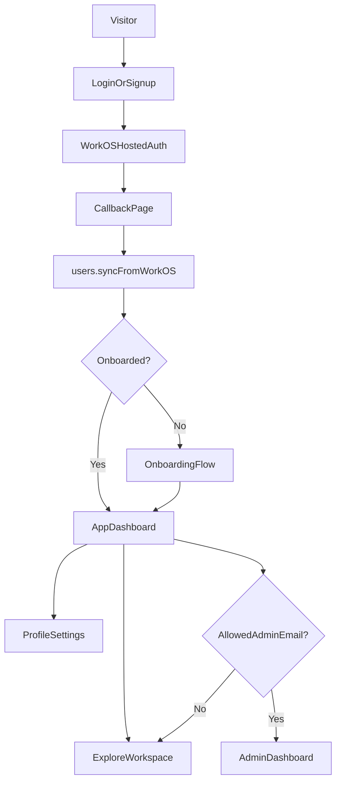

# UI, Dashboard, And Admin Plan

## Current Baseline
These pieces are already in place and should be treated as existing implementation, not greenfield scope:

- WorkOS + Convex auth wiring in [src/App.tsx](src/App.tsx) and [convex/auth.config.ts](convex/auth.config.ts)
- Auth routes for `/login`, `/signup`, `/callback`, `/onboarding`, `/profile`, `/app`, and `/admin` in [src/App.tsx](src/App.tsx)
- User provisioning and onboarding/profile mutations in [convex/users.ts](convex/users.ts)
- Required India phone capture in [convex/schema.ts](convex/schema.ts) and [convex/users.ts](convex/users.ts)

The plan below focuses on what is still missing: **visual consistency, signed-in UX quality, and stricter admin authorization**.

## Product Direction
- Keep the public landing experience as the visual reference, especially the tone and component language from [src/routes/Explore.tsx](src/routes/Explore.tsx), [src/components/TopNav.tsx](src/components/TopNav.tsx), and [src/components/SiteShell.tsx](src/components/SiteShell.tsx).
- Rebuild the authenticated product surfaces to feel like a modern SaaS dashboard: clean structure, strong hierarchy, calm spacing, clear navigation, and fast orientation similar to Stripe.
- Keep Explore/job discovery as the center of gravity after sign-in.
- Make admin feel like a protected operational workspace, not a separate random page style.

## Plan
1. **Create one authenticated shell and stop styling each page as an island.**
   - Introduce a shared signed-in layout for [src/routes/AppHome.tsx](src/routes/AppHome.tsx), [src/routes/Profile.tsx](src/routes/admin/AdminDashboard.tsx), and the onboarding/auth transition pages where appropriate.
   - Reuse the same design vocabulary already present on the landing page: typography, surface colors, muted gradients, rounded cards, and restrained motion.
   - Move away from the current plain gray-background pages and ad hoc top navs toward a consistent dashboard frame with a top bar, optional left rail, page titles, and stable action zones.

2. **Polish the login-to-product experience for best-in-class UX.**
   - Keep WorkOS-hosted auth, but redesign [src/routes/Login.tsx](src/routes/Login.tsx), [src/routes/Signup.tsx](src/routes/Signup.tsx), and [src/routes/Callback.tsx](src/routes/Callback.tsx) so they feel branded and intentional rather than loading placeholders.
   - Make the callback/loading states reassuring and premium, with clearer progress messaging and failure recovery.
   - Refine [src/routes/Onboarding.tsx](src/routes/Onboarding.tsx) into a high-quality first-run flow that feels like part of the product, not a separate utility form.

3. **Turn `/app` into a real dashboard, not a menu of generic cards.**
   - Redesign [src/routes/AppHome.tsx](src/routes/AppHome.tsx) as the signed-in Explore dashboard with a modern SaaS information hierarchy.
   - Use the landing page’s job-discovery personality as the base, then add dashboard structure: welcome/header, quick context, meaningful actions, curated job sections, and clear paths into Explore, pricing, and profile.
   - Replace the current emoji-card launcher feel with richer cards, cleaner copy, stronger data density, and more obvious next actions.
   - Keep the redirect target after login and onboarding as `/app`, but make `/app` feel like the true home of the product.

4. **Bring profile and onboarding into the same premium system.**
   - Redesign [src/routes/Profile.tsx](src/routes/Profile.tsx) as a proper settings page inside the authenticated shell.
   - Keep the current data model (`name`, `intent`, `phoneE164`) but improve structure, sectioning, inline validation, save feedback, and sign-out/account actions.
   - Ensure onboarding and profile share components and interaction patterns so the product feels cohesive before and after account setup.

5. **Harden admin access around the one allowed email.**
   - Update backend enforcement so admin access is not merely `role === "admin"` in [convex/helpers.ts](convex/helpers.ts).
   - Enforce that only `inet.nishant@gmail.com` can access admin-only queries and mutations, with the check anchored in authenticated identity data and synchronized user records.
   - Update [convex/users.ts](convex/users.ts) so admin assignment is durable on every sync, not only during first user creation.
   - Keep the frontend admin entry hidden unless the current user matches the allowed admin rule, but treat backend enforcement as the real source of truth.

6. **Fix the admin dashboard logic before polishing the visuals.**
   - Align [src/routes/admin/AdminDashboard.tsx](src/routes/admin/AdminDashboard.tsx) with the actual response shape from [convex/admin.ts](convex/admin.ts), because the current UI expects fields the backend does not return.
   - Decide whether to expand the backend metrics or simplify the UI to the metrics already available, then redesign around that real contract.
   - Present the admin dashboard like a modern operational console: summary metrics first, trend/context second, actions third.
   - Keep the admin UI visually aligned with the main app while clearly signaling elevated access.

7. **Clean up navigation, redirects, and loading behavior across the signed-in app.**
   - Replace in-render redirects with cleaner route guard behavior in [src/routes/AppHome.tsx](src/routes/Onboarding.tsx), [src/routes/admin/AdminDashboard.tsx](src/routes/admin/AdminDashboard.tsx), and related pages.
   - Make loading, empty, and error states feel deliberate across auth and dashboard routes.
   - Ensure the top-level nav in [src/components/TopNav.tsx](src/components/TopNav.tsx) and the authenticated shell work together instead of feeling like two unrelated products.

## Key Findings To Address
- The signed-in pages currently use a generic gray dashboard style and do not match the landing-page design quality.
- `/app` exists, but it behaves more like a simple launcher than a modern Explore dashboard.
- Admin access is currently enforced mainly through `role`, while your product rule is stricter: only `inet.nishant@gmail.com` should have access.
- [src/routes/admin/AdminDashboard.tsx](src/routes/admin/AdminDashboard.tsx) expects dashboard fields that [convex/admin.ts](convex/admin.ts) does not currently return.

## Key Files
- [src/App.tsx](src/App.tsx)
- [src/routes/Explore.tsx](src/routes/Explore.tsx)
- [src/routes/AppHome.tsx](src/routes/AppHome.tsx)
- [src/routes/Onboarding.tsx](src/routes/Onboarding.tsx)
- [src/routes/Profile.tsx](src/routes/Profile.tsx)
- [src/routes/Login.tsx](src/routes/Login.tsx)
- [src/routes/Signup.tsx](src/routes/Signup.tsx)
- [src/routes/Callback.tsx](src/routes/Callback.tsx)
- [src/routes/admin/AdminDashboard.tsx](src/routes/admin/AdminDashboard.tsx)
- [src/components/TopNav.tsx](src/components/TopNav.tsx)
- [convex/users.ts](convex/users.ts)
- [convex/helpers.ts](convex/helpers.ts)
- [convex/admin.ts](convex/admin.ts)

## Outcome
After this rewrite, the remaining work is clearly focused on:

- a polished signed-in product experience that visually belongs with the landing page
- a Stripe-inspired dashboard structure for `/app` and `/admin`
- a smoother login, callback, onboarding, and post-login journey
- stricter admin protection so only `inet.nishant@gmail.com` can access admin
- an admin dashboard whose frontend and backend logic actually match